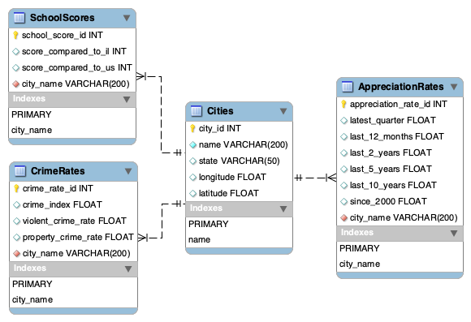
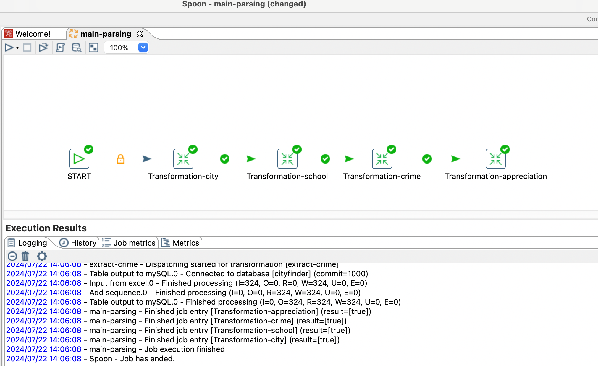

## CityFinder ETL Process

Welcome! This README file provides an overview of the ETL (Extract, Transform, Load) process for the CityFinder application. The goal of this project is to [scrape](https://github.com/YoungSong99/city-finder-web-scraping
), transform, and load data about various cities into a MySQL database, facilitating the CityFinder app's functionalities.

### Data Model
The data model for CityFinder consists of four main tables: Cities, SchoolScores, CrimeRates, and AppreciationRates. Below is an ER diagram depicting the relationships among these tables: 

### ETL Process
The ETL process is implemented using Pentaho Data Integration (Kettle), specifically the Spoon tool. 
The process involves extracting data from various sources, transforming it to fit the desired schema, and loading it into the MySQL database.

### Steps

**Transformation-city**: Extracts city data, transforms it, and loads it into the Cities table. 
**Transformation-school**: Extracts school score data, transforms it, and loads it into the SchoolScores table. 
**Transformation-crime**: Extracts crime rate data, transforms it, and loads it into the CrimeRates table. 
**Transformation-appreciation**: Extracts appreciation rate data, transforms it, and loads it into the AppreciationRates table.
